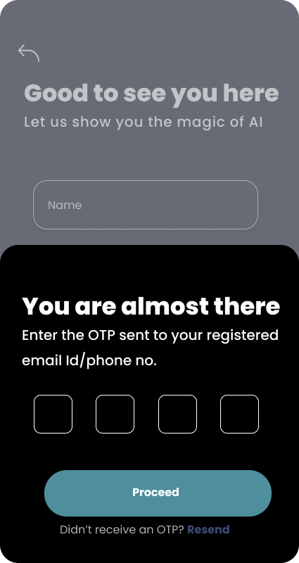

#AI

Hello,
This is an Law Assistance App titled as 'Law Tip'.

Proposed Solution:
- AI-Powered Legal Assistance: Use AI to provide legal support in family, property, labor, and criminal law, with multilingual capabilities. 
- Increased Citizen Awareness: Make legal information accessible and understandable, with simplification of legal language using AI.
- Improved Access to Justice: Simplify legal processes and procedures, enabling citizens to seek justice more effectively.
- Accessibility and Inclusivity: Implement voice-to-text and text-to-speech features, enhancing accessibility for a broader audience.
- Enhanced User Engagement: Offer content in different modalities, such as text, audio, and video, to grasp information effectively
- Multimodal Content Delivery: Provide content in multiple formats, such as blogs, comic strips, short films, and audio, creating a comprehensive learning experience.
- Accessibility Across Devices: The application can be accessed through smartphones, tablets, and desktop computers, ensuring that individuals with different levels of technology access can benefit from it.
- Business Potential: We are also planning connect clients with lawyers of their choice and generate revenue

NOTE: The app is still in development

Below are some of the screenshots of the UI of the app
                                                                                                      

